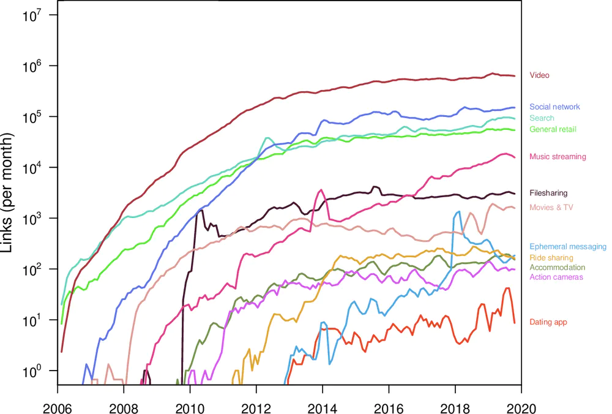

The online world is continuously expanding — always aggregating more services, more users and more activity. Last year, the number of websites registered on the ".com" domain [surpassed 150,000,000](https://www.verisign.com/en_US/channel-resources/domain-registry-products/zone-file/index.xhtml).

However, more than a quarter of a century since its first commercial use, the growth of the online world is now slowing down in some key categories.

We conducted a multi-year research project analysing global trends in online diversity and dominance. [Our research](https://journals.plos.org/plosone/article?id=10.1371/journal.pone.0249993), published in Public Library of Science, is the first to reveal some long-term trends in how businesses compete in the age of the web.

We saw a dramatic consolidation of attention towards a shrinking (but increasingly dominant) group of online organisations. So, while there is still growth in the functions, features and applications offered on the web, the number of entities providing these functions is shrinking. 

## Web diversity nosedives

We analysed more than six billion user comments from the social media website Reddit dating back to 2006, as well as 11.8 billion Twitter posts from as far back as 2011. In total, our research used a massive 5.6Tb trove of data from more than a decade of global activity.

This dataset was more than four times the size of the original data from the Hubble Space Telescope, which helped Brian Schmidt and colleagues do their [Nobel-prize winning work](https://theconversation.com/nobel-prize-win-tells-us-the-universe-is-accelerating-what-does-that-mean-3753) in 1998 to prove [the universe's expansion is accelerating](https://iopscience.iop.org/article/10.1086/300499/meta).

With the Reddit posts, we analysed all the links to other sites and online services — more than one billion in total — to understand the dynamics of link growth, dominance and diversity through the decade.

We used a measure of link "uniqueness". On this scale, 1 represents maximum diversity (all links have their own domain) and 0 is minimum diversity (all links are on one domain, such as "youtube.com").

A decade ago, there was a much greater variety of domains within links posted by users of Reddit, with more than 20 different domains for every 100 random links users posted. Now there are only about five different domains for every 100 links posted.

In fact, between 60-70% of all attention on key social media platforms is focused towards just ten popular domains.

Beyond social media platforms, we also studied linkage patterns across the web, looking at almost 20 billion links over three years. These results reinforced the "rich are getting richer" online.

The authority, influence and visibility of the top 1,000 global websites (as measured by network centrality or PageRank) is growing every month, at the expense of all other sites.

## App diversity is on the rise

The web started as a source of innovation, new ideas and inspiration — a technology that opened up the playing field. It's now also becoming a medium that actually stifles competition and promotes monopolies and the dominance of a few players.

Our findings resolve a long-running paradox about the nature of the web: does it help grow businesses, jobs and investment? Or does it make it harder to get ahead by letting anyone and everyone join the game? The answer, it turns out, is it does both.

While the diversity of sources is in decline, there is a countervailing force of continually increasing functionality with new services, products and applications — such as music streaming services (Spotify), file sharing programs (Dropbox) and messaging platforms (Messenger, Whatsapp and Snapchat). 

## Website ‘infant mortality'

Another major finding was the dramatic increase in the "infant mortality" rate of websites — with the big kids on the block guarding their turf more staunchly than ever.

We examined new domains that were continually referenced or linked-to in social media after their first appearance. We found that while almost 40% of the domains created 2006 were active five years on, only a little more than 3% of those created in 2015 remain active today.

The dynamics of online competition are becoming clearer and clearer. And the loss of diversity is concerning. Unlike the natural world, there are no sanctuaries; competition is part of both nature and business.

Our study has profound implications for business leaders, investors and governments everywhere. It shows the network effects of the web don't just apply to online businesses. They have permeated the entire economy and are rewriting many previously accepted rules of economics.

For example, the idea that businesses can maintain a competitive advantage based on where they are physically located is increasingly tenuous. Meanwhile, there's new opportunities for companies to set up shop from anywhere in the world and serve a global customer base that's both mainstream and niche.

The best way to encourage diversity is to have more global online businesses focused on providing diverse services, by addressing consumers' increasingly niche needs.

In Australia, we're starting to see this through homegrown companies such as [Canva](https://www.canva.com/), [SafetyCulture](https://safetyculture.com/) and [iWonder](https://iwonder.com/). Hopefully many more will appear in the decade ahead.

_This article was first published by the authors on [The Conversation](https://theconversation.com/we-spent-six-years-scouring-billions-of-links-and-found-the-web-is-both-expanding-and-shrinking-159215)._
